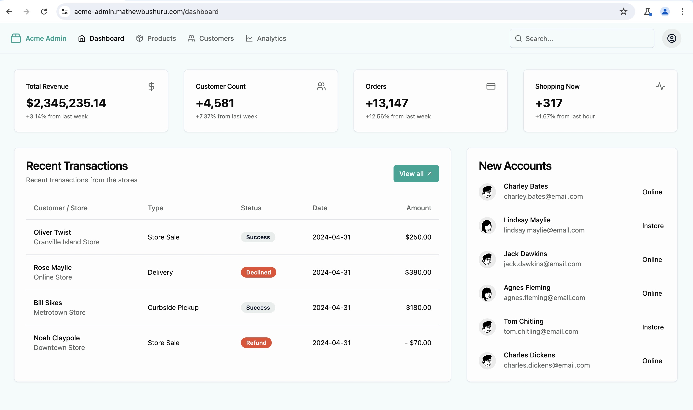
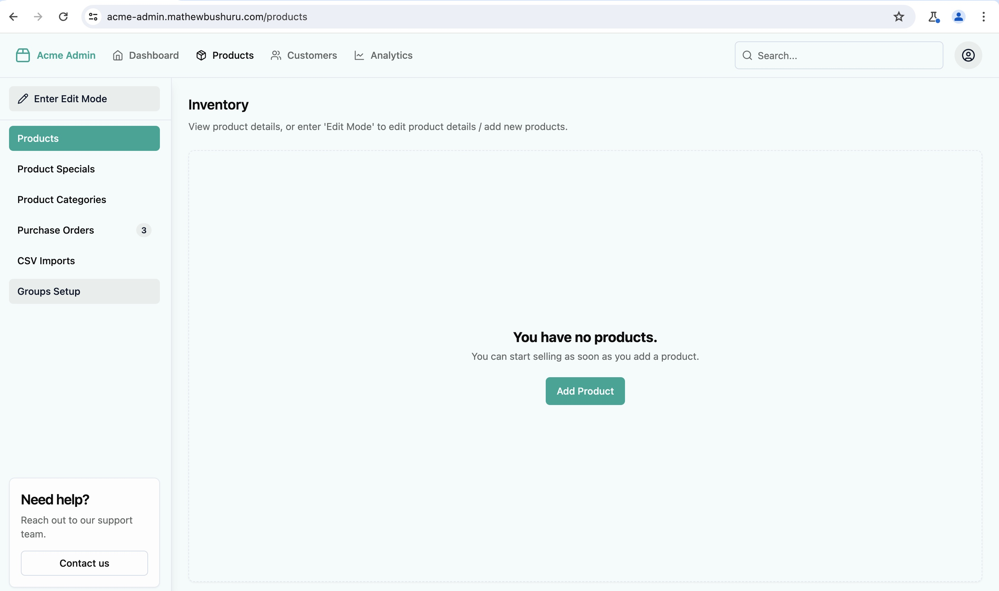

### ACME Ecommerce

Building blocks for digital commerce.

This project aims to create modularized commerce logic blocks that can be reused in e-commerce applications, for example, a cart module, a product module, authentication, customer loyalty, analytics, pricing and similar tools.

To achieve this, I am building several e-commerce applications in this repo, and once I am done, I will extract out the reusable module/logic into an open-source package that can help in quickly setting up an e-commerce store. These applications include a standard e-commerce app for a single company selling products to its customers, an online marketplace with multiple vendors on a single storefront, a subcription business for digital goods, alongside the back-office applications to support them such as Point-of-Sales software.

The name *Acme* is from the *Wile E. Coyote* animations and is used a generic company name in many  cartoons. In the past, it was commonly used in the names of real businesses in order to be listed towards the beginning of alphabetized telephone directories like the *Yellow Pages*. I think this makes it a perfect stand-in for an e-commerce company. The apps I'm building in this repo are e-commerce grocery applications since that's what I have the most experience with at the moment but I hope to generalize them in the future of any online business.

##### Progress - /frontend

Live URL: [`acme.mathewbushuru.com`](https://acme.mathewbushuru.com/)

Demo credentials: `mattb@test.com` , `Tester123!`

Home page

Auth

##### Progress - /admin-web-frontend

Live URL: [`acme-admin.mathewbushuru.com`](https://acme-admin.mathewbushuru.com/)

Demo credentials: `mattb@test.com` , `81*admiN`

Home page

Products page

Auth

##### Progress - /server

A Node/Express backend + Postgres Database

> [!NOTE]
> There is code for both MySQL and PostgreSQL under `/server/src/mysql-database` and `/server/src/postgres-database` respectively. This project was initially using a MySQL database on AWS but I refactored it to use Postgres instead. MySQL is left here for future reference.

##### Progress - /backoffice-desktop-app

A .NET/C# desktop app

Also experimenting with a Java GUI app in this folder. 

##### Progress - /dotnet-server

An C# ASP.NET API developed in parallel with the ExpressJS server in the `/server` directory. I aim for both APIs to have the same functionality.