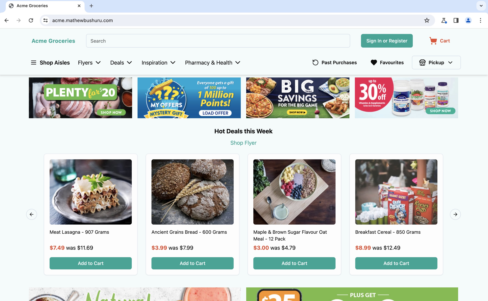
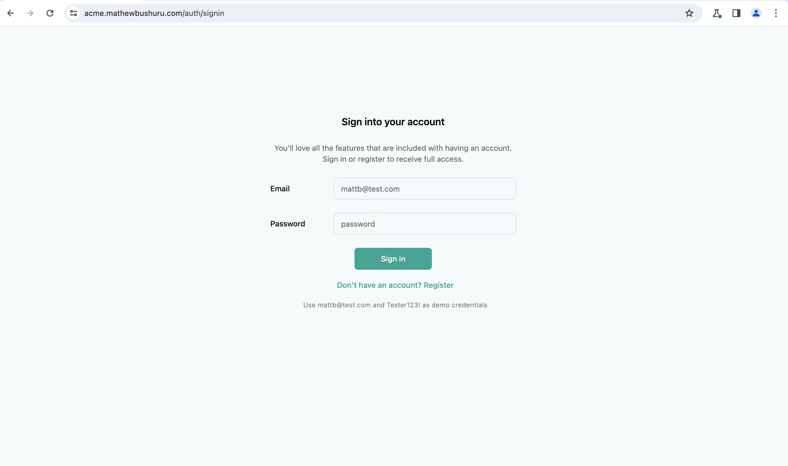
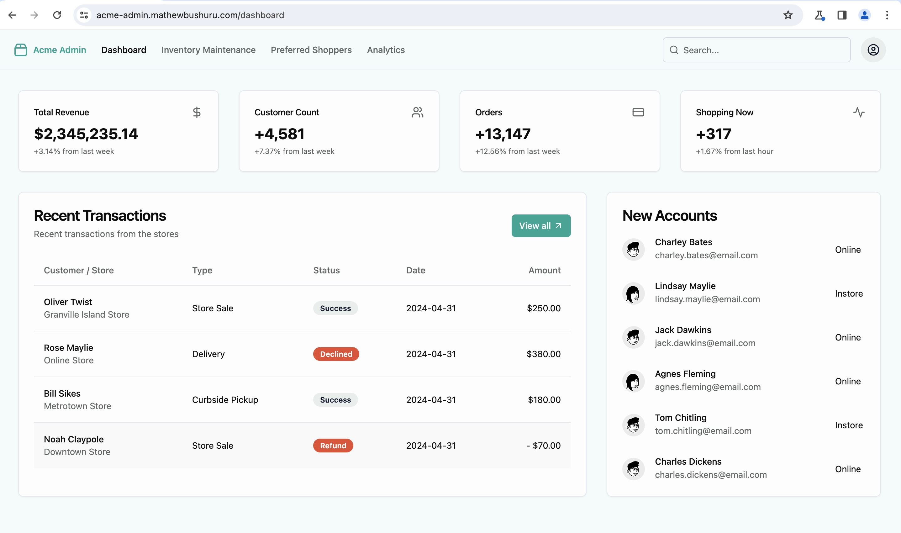
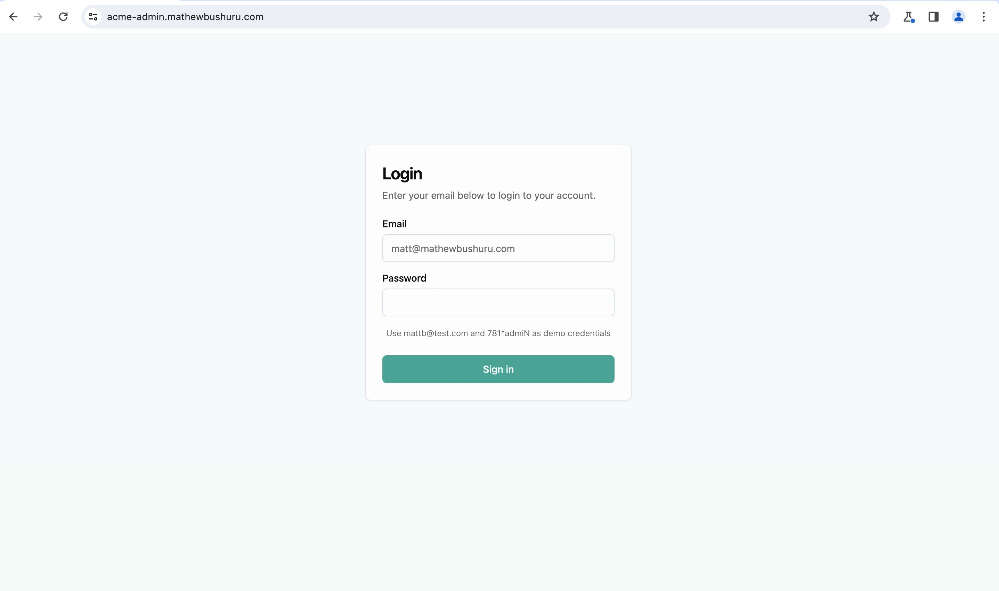
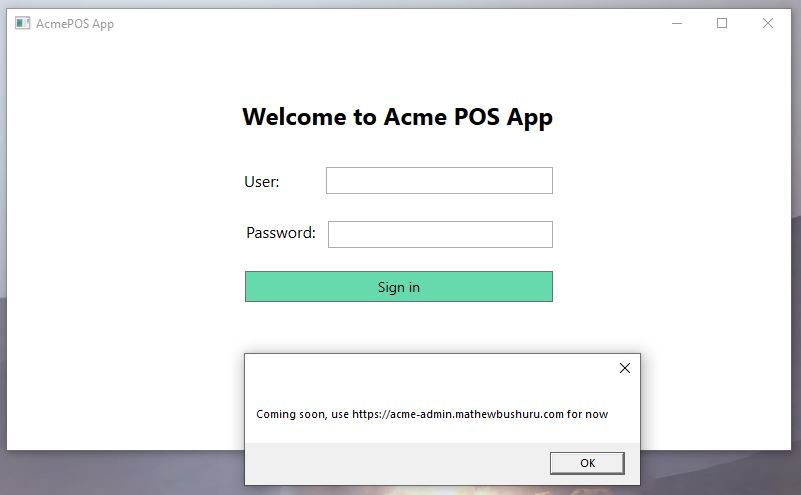

### ACME Ecommerce

Building blocks for digital commerce

##### /frontend

Live URL: [`acme.mathewbushuru.com`](https://acme.mathewbushuru.com/)

Demo credentials: `mattb@test.com` , `Tester123!`

Home page

Auth

##### /admin-web-frontend

Live URL: [`acme-admin.mathewbushuru.com`](https://acme-admin.mathewbushuru.com/)

Demo credentials: `mattb@test.com` , `81*admiN`

Home page

Auth

##### /server

A Node/Express backend + Postgres Database

> [!NOTE]
> There is code for both MySQL and PostgreSQL under `/server/src/mysql-database` and `/server/src/postgres-database` respectively. This project was initially using a MySQL database on AWS but I refactored it to use Postgres instead. MySQL is left here for future reference.

##### /backoffice-desktop-app

A .NET/C# desktop app

Also experimenting with a Java GUI app in this folder. Might move to a MAUI app to get a cross-platform MacOS and Windows Desktop app.

##### /dotnet-server

An C# ASP.NET API developed in parallel with the ExpressJS server in the `/server` directory. I aim for both APIs to have the same functionality.